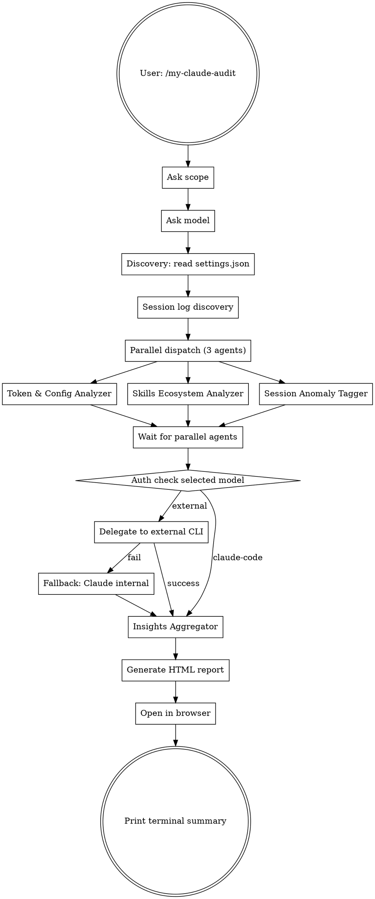

# Audit-Skill v2: Multi-Model Delegation — Implementation Plan

> **For agentic workers:** REQUIRED: Use superpowers:subagent-driven-development (if subagents available) or superpowers:executing-plans to implement this plan. Steps use checkbox (`- [ ]`) syntax for tracking.

**Goal:** Extend the audit skill to delegate insights analysis to external CLI models (Gemini, OpenAI, Codex), add session log anomaly detection, and present findings through Cold Tech Lead + Instruction Patch Designer personas.

**Architecture:** Hybrid delegation — Phases 1-2 always run internally (file access needed), Phase 3 routes to user-selected external CLI or Claude fallback. New 3rd parallel agent for session JSONL analysis. HTML template gets 2 new cards + header badge.

**Tech Stack:** Markdown prompt files, Bash shell script, HTML/CSS/JS (vanilla, no build system)

**Spec:** `docs/superpowers/specs/2026-04-06-audit-skill-v2-multi-model-delegation-design.md`

---

## Chunk 1: New Session Anomaly Tagger Agent

### Task 1: Create session-anomaly-tagger.md prompt

**Files:**
- Create: `skills/my-claude-audit/analyzer-prompts/session-anomaly-tagger.md`

- [ ] **Step 1: Create the prompt file**

```markdown
# Session Anomaly Tagger

You are analyzing Claude Code session logs to detect inefficient AI usage patterns. You are a field inspector who captures bad habits with minimal tokens.

## Your Input

You will receive:

1. List of JSONL session file paths (max 5 most recent sessions)
2. Current project directory path

## Your Tasks

### 1. Parse Session Logs

For each JSONL file, read line by line and parse JSON objects. Each line is one of these types:
- `user`: User messages with `message.content` and `timestamp`
- `assistant`: Model responses with `message.content` and `timestamp`
- `progress`: Tool execution events with `data` and `toolUseID`
- `system`: System messages with `content` (may contain `/clear` or `/compact`)

Skip lines that fail to parse. Skip `queue-operation` and `file-history-snapshot` types.

### 2. Collect Per-Session Statistics

For each session, compute:
- **Turn count**: Number of `user` type messages
- **Average user prompt length**: Mean character count of `message.content` across all `user` messages (flatten arrays to text)
- **Short prompt count**: User messages with content length < 30 characters
- **Short prompt without constraints count**: Short prompts that do NOT contain any of these constraint keywords (English + Korean): because, should, must, when, if, error, bug, test, 왜, 이유, 조건, 테스트, 에러, 해야, 반드시, 언제, 때, 만약, 경우
- **Machine-generated text ratio per user message**: For each user message, count lines matching these patterns:
  - Stack trace prefixes: lines starting with `at `, `Error:`, `Traceback`, `File "`, `  at `, `Caused by:`
  - Log patterns: lines with timestamp prefixes (`[2026-`, `2026-04-`) or log levels (`[ERROR]`, `[WARN]`, `DEBUG`)
  - If average line length > 120 chars, add 0.2 to ratio
  - Ratio = (matching lines) / (total lines). Flag messages where ratio > 0.8 AND total lines > 100
- **File path references per user message**: Count distinct path-like patterns per message. A path-like pattern is either: (a) a string containing `/` followed by a file extension (`.ts`, `.js`, `.py`, `.tsx`, `.jsx`, `.css`, `.html`, `.md`, `.json`, `.yaml`, `.yml`, `.go`, `.rs`, `.java`), or (b) a directory-like path prefix (`src/`, `lib/`, `app/`, `components/`, `pages/`, `utils/`, `test/`, `tests/`)
- **Max consecutive turns without clear**: Longest streak of consecutive `user` messages with no intervening `system` message containing `/clear` or `/compact`
- **Verification rate**: Between each (assistant message containing triple-backtick code fences) and (next user message), check if any `progress` messages exist whose stringified `data` matches these verification patterns:
  - Tool name contains: `test`, `lint`, `check`, `build`, `run`, `exec`, `jest`, `vitest`, `pytest`, `eslint`, `tsc`
  - Or Bash command contains: `npm test`, `npm run`, `yarn test`, `pnpm test`, `make test`, `cargo test`, `go test`, `python -m pytest`
  - Rate = (code-then-verified pairs) / (total code-generation pairs)

### 3. Apply Anomaly Tags

Apply these tags based on the per-session statistics:

| Tag | Condition |
|-----|-----------|
| `TAG_ERR_DUMP` | Any user message has machine-generated ratio > 0.8 AND > 100 lines |
| `TAG_ONESHOT_WAR` | Any user message references 3+ distinct file paths |
| `TAG_CTX_HOARD` | Max consecutive turns without clear > 20 |
| `TAG_SILENT_FIX` | More than 30% of user messages are short prompts without constraints |
| `TAG_BLIND_FOLLOW` | Verification rate < 0.3 (less than 30% of code outputs were verified) |

### 4. Generate Findings

For each triggered tag, create a finding with:
- `severity`: "warning" for all anomaly tags
- `category`: "session-anomaly"
- `title`: Human-readable tag description
- `detail`: Evidence string with session ID, metric values
- `suggestion`: One-line improvement action

## Output Format

Return ONLY valid JSON. No prose, no markdown, no explanation outside the JSON.

```json
{
  "category": "session-anomaly",
  "findings": [
    {
      "severity": "warning",
      "category": "session-anomaly",
      "title": "Context hoarding detected",
      "detail": "Session 8700f461 ran 45 turns without /clear.",
      "suggestion": "Use /clear when switching tasks to free context window"
    }
  ],
  "metrics": {
    "sessionsAnalyzed": 5,
    "totalTurns": 142,
    "avgPromptLength": 67,
    "anomalyTags": ["TAG_CTX_HOARD", "TAG_SILENT_FIX"]
  },
  "sessionBreakdown": [
    {
      "sessionId": "8700f461-...",
      "turns": 45,
      "anomalies": ["TAG_CTX_HOARD"],
      "stats": {
        "user_input_avg_len": 38,
        "max_gap_without_clear": 32,
        "machine_text_ratio": 0.15,
        "verification_rate": 0.3
      }
    }
  ]
}
```

## Graceful Degradation

- If a JSONL file cannot be read or parsed, skip it and note as an info-level finding.
- If no session files are provided, return empty results with `sessionsAnalyzed: 0`.
- Never fail the entire analysis because one session is corrupt.

IMPORTANT: Return ONLY the JSON object above. No text before or after.
```

- [ ] **Step 2: Verify file exists and is well-formed**

Run: `wc -l skills/my-claude-audit/analyzer-prompts/session-anomaly-tagger.md && head -5 skills/my-claude-audit/analyzer-prompts/session-anomaly-tagger.md`
Expected: File exists with `# Session Anomaly Tagger` header

- [ ] **Step 3: Commit**

```bash
git add skills/my-claude-audit/analyzer-prompts/session-anomaly-tagger.md
git commit -m "feat(audit): add session anomaly tagger prompt

New subagent prompt that analyzes JSONL session logs for 5 inefficient
AI usage patterns: ERR_DUMP, ONESHOT_WAR, CTX_HOARD, SILENT_FIX,
BLIND_FOLLOW."
```

---

## Chunk 2: CLI Delegation Script

### Task 2: Create delegate.sh

**Files:**
- Create: `skills/my-claude-audit/scripts/delegate.sh`

- [ ] **Step 1: Create the scripts directory and script**

```bash
#!/bin/bash
# Delegates prompt to external CLI tool with per-tool invocation
# Usage: delegate.sh <cli-tool-name> <prompt-file> [timeout]
# Returns: stdout text, exit 0 on success, exit 1 on failure

set -euo pipefail

CLI_TOOL="$1"
PROMPT_FILE="$2"
TIMEOUT="${3:-120}"

if [ ! -f "$PROMPT_FILE" ]; then
    echo "Error: Prompt file not found: $PROMPT_FILE" >&2
    exit 1
fi

if ! command -v "$CLI_TOOL" &>/dev/null; then
    echo "Error: $CLI_TOOL not found in PATH" >&2
    exit 1
fi

invoke_tool() {
    local tool="$1"
    local file="$2"
    local t="$3"

    case "$tool" in
        gemini)
            timeout "$t" gemini < "$file" 2>/dev/null
            ;;
        openai)
            timeout "$t" openai api chat.completions.create \
                -m gpt-4o -M "$(cat "$file")" 2>/dev/null
            ;;
        codex)
            timeout "$t" codex "$(cat "$file")" 2>/dev/null
            ;;
        *)
            local result
            result=$(timeout "$t" "$tool" < "$file" 2>/dev/null) || true
            if [ -n "$result" ]; then
                echo "$result"
                return 0
            fi
            result=$(timeout "$t" "$tool" --prompt "$file" 2>/dev/null) || true
            if [ -n "$result" ]; then
                echo "$result"
                return 0
            fi
            return 1
            ;;
    esac
}

RESULT=$(invoke_tool "$CLI_TOOL" "$PROMPT_FILE" "$TIMEOUT") || true
if [ -n "$RESULT" ]; then
    echo "$RESULT"
    exit 0
fi

exit 1
```

- [ ] **Step 2: Make executable and verify**

Run: `chmod +x skills/my-claude-audit/scripts/delegate.sh && bash -n skills/my-claude-audit/scripts/delegate.sh`
Expected: No syntax errors (exit 0)

- [ ] **Step 3: Commit**

```bash
git add skills/my-claude-audit/scripts/delegate.sh
git commit -m "feat(audit): add CLI delegation script

Per-tool invocation map for gemini, openai, codex, and custom tools.
Auto-detect stdin vs file argument with 120s timeout."
```

---

## Chunk 3: Update insights-aggregator.md

### Task 3: Add session-anomaly input, Cold Tech Lead persona, and Instruction Patch Designer

**Files:**
- Modify: `skills/my-claude-audit/analyzer-prompts/insights-aggregator.md:1-225`

- [ ] **Step 1: Add session-anomaly to input section**

In `insights-aggregator.md`, after line 10 (`2. **Skills Ecosystem Analyzer** (category: "skills-ecosystem")`), add:

```markdown
3. **Session Anomaly Tagger** (category: "session-anomaly")
```

- [ ] **Step 2: Add Cold Tech Lead persona section**

After the "### 4. Health & Optimization Score" section (after the score labels block, around line 118), add a new section:

```markdown
### 5. Session Insights — Cold Tech Lead

Adopt the "Cold Tech Lead" persona for session-related analysis. You are a cynical, technically precise senior developer who despises inefficiency. No praise. No softening.

Based on the session-anomaly data, generate:

- **[Status]**: One sarcastic sentence assessing the developer's AI usage level. Examples:
  - "토큰을 불태워 난로를 떼는 원시인 수준이군요."
  - "세션 관리 능력이 2024년 GPT wrapper 수준에 머물러 있습니다."
- **[Critical Issues]**: For each detected anomaly tag, write a technically precise critique backed by data. Be direct and cutting. Example:
  - "TAG_CTX_HOARD: 세션을 25턴이나 끌고 가는 건 모델의 지능을 깎아먹겠다는 선전포고인가요? 당신의 월급이 토큰 비용으로 나가고 있지 않음에 감사하십시오."
- **[Prescription]**: Exactly ONE immediately actionable improvement command. Example:
  - "당장 /clear 하세요. 매 작업 전환 시 반드시 실행하십시오."

Rules:
- Never use "잘하고 있지만~", "노력하세요" or any softening language
- Only use efficiency data and logic to criticize
- If no anomaly tags were detected, write: "세션 로그가 제공되지 않았거나 이상 패턴이 감지되지 않았습니다."

### 6. Instruction Patches — System Instruction Patch Designer

For each detected anomaly tag, generate a concrete instruction patch that can be appended to the user's CLAUDE.md. These are enforceable system instructions, not suggestions.

Design principles:
- **Enforcement**: "거절하거나 다시 물으세요" — command Claude to refuse or redirect, never merely advise
- **Explicit triggers**: Specify the exact condition that activates the patch
- **Token-efficient**: Core logic only as a concise Markdown list

Tag-to-patch mapping:

| Tag | Patch |
|-----|-------|
| TAG_ERR_DUMP | "- [조건]: 사용자가 분석이나 요약 없이 50라인 이상의 로그를 입력할 경우.\n- [행동]: 즉시 분석을 중단하고 '로그의 핵심 에러 5줄과 발생 맥락을 요약해서 다시 주십시오'라고 요청하십시오." |
| TAG_SILENT_FIX | "- [조건]: 의도가 불분명한 30자 미만의 수정 요청.\n- [행동]: '어떤 부작용을 고려해야 하는지, 기대하는 결과가 무엇인지' 되물으십시오." |
| TAG_CTX_HOARD | "- [조건]: 대화가 15턴을 초과할 경우.\n- [행동]: 세션 요약 후 /clear 할 것을 강력히 권고. 20턴 초과 시 매 응답 앞에 경고 표시." |
| TAG_BLIND_FOLLOW | "- [조건]: 코드 생성 직후 테스트 없이 다음 구현 요청.\n- [행동]: '이전 변경사항을 먼저 검증하셨나요? npm test 또는 관련 명령을 실행해 주세요'라고 요청." |
| TAG_ONESHOT_WAR | "- [조건]: 한 번의 요청으로 3개 이상의 파일을 동시 수정하려 할 경우.\n- [행동]: 작업을 단계별로 분리하도록 제안. 각 단계마다 검증 후 다음으로 진행." |

Generate patches ONLY for tags that were actually detected in the session-anomaly data.
```

- [ ] **Step 3: Update output JSON schema**

In the output format JSON block (around line 132), add `sessionInsights` and `instructionPatches` to the JSON example. After the `crossLayerInsights` array, add:

```json
  "sessionInsights": {
    "status": "토큰을 불태워 난로를 떼는 원시인 수준이군요.",
    "criticalIssues": [
      {
        "tag": "TAG_CTX_HOARD",
        "critique": "세션을 32턴이나 끌고 가는 건 모델의 지능을 깎아먹겠다는 선전포고인가요?",
        "evidence": "Session 8700f461: 45 turns, 0 /clear calls"
      }
    ],
    "prescription": "/clear 습관화: 매 작업 전환 시 반드시 실행",
    "anomalyTagsSummary": ["TAG_CTX_HOARD", "TAG_SILENT_FIX"],
    "instructionPatches": [
      {
        "targetProblem": "컨텍스트 비대화",
        "triggerTag": "TAG_CTX_HOARD",
        "principle": "강제 세션 위생 관리",
        "patch": "- [조건]: 대화가 15턴을 초과할 경우.\n- [행동]: 세션 요약 후 /clear 할 것을 강력히 권고. 20턴 초과 시 매 응답 앞에 경고 표시.",
        "scenario": "20턴 이상 대화 지속 시 → 자동 경고 + /clear 권유"
      }
    ]
  }
```

- [ ] **Step 4: Verify the file is valid Markdown**

Run: `wc -l skills/my-claude-audit/analyzer-prompts/insights-aggregator.md`
Expected: ~300+ lines (up from 225)

- [ ] **Step 5: Commit**

```bash
git add skills/my-claude-audit/analyzer-prompts/insights-aggregator.md
git commit -m "feat(audit): add Cold Tech Lead + Instruction Patch personas

Update insights aggregator with:
- Session anomaly data as 3rd input source
- Cold Tech Lead persona for brutal session diagnostics
- System Instruction Patch Designer for enforceable remediation"
```

---

## Chunk 4: Update SKILL.md Workflow

### Task 4: Add model selection to Phase 0

**Files:**
- Modify: `skills/my-claude-audit/SKILL.md:1-167`

- [ ] **Step 1: Update frontmatter description**

Change lines 3-7 from:

```yaml
description: >
  /my-claude-audit command only.
  Comprehensive audit of Claude Code configuration: token budget visualization,
  config health, semantic conflict detection, skills ecosystem analysis,
  missed commands, and automation opportunities. Generates interactive HTML dashboard.
```

To:

```yaml
description: >
  /my-claude-audit command only.
  Comprehensive audit of Claude Code configuration with multi-model delegation:
  token budget, config health, skills ecosystem, session log anomaly detection,
  and AI usage pattern analysis. Supports Gemini/OpenAI/Codex CLI delegation.
  Generates interactive HTML dashboard.
```

- [ ] **Step 2: Update workflow diagram**

Replace the entire `digraph workflow` block (lines 17-43) with:



- [ ] **Step 3: Add Phase 0.5 — Model Selection**

After the Phase 0: Scope Selection section (after line 52), add:

```markdown
## Phase 0.5: Model Selection

Scan for available external CLI tools:

1. Run `which gemini`, `which openai`, `which codex` to detect installed tools
2. Check env vars: `GEMINI_API_KEY`, `OPENAI_API_KEY` (existence only)

Ask the user with AskUserQuestion (Korean labels):

Build options dynamically — only show installed tools. Always include:
- Each installed tool as an option, annotated with "(API 키 감지)" if env var exists
- **Claude Code (내장)** — always available, no external dependency
- **직접 입력** — user types a custom CLI command

Store the selection for Phase 3 delegation and `meta.analyzer` report attribution.
```

- [ ] **Step 4: Add session log discovery to Phase 1**

After the existing Phase 1 content (after line 71), add:

```markdown
### Session Log Discovery

- Resolve current project path encoding: replace `/` with `-` in `$PWD`, strip leading `-`
- List `~/.claude/projects/<encoded-cwd>/*.jsonl` (exclude `subagents/` subdirectories)
- Sort by modification time descending, select up to 5 most recent
- If no JSONL files found, note as info-level and skip session analysis
```

- [ ] **Step 5: Update Phase 2 to dispatch 3 agents**

Replace the Phase 2 dispatch block (lines 83-90) with:

```markdown
**Dispatch (parallel):**

```
Agent 1: token-and-config.md prompt + discovery data + scope
Agent 2: skills-ecosystem.md prompt + enabledPlugins + pluginMarketplaces
Agent 3: session-anomaly-tagger.md prompt + session JSONL file paths
```

All three run in parallel. Wait for all to complete.
```

- [ ] **Step 6: Update Phase 3 with delegation logic**

Replace Phase 3 (lines 92-100) with:

```markdown
## Phase 3: Insights Aggregation (delegatable)

After all parallel agents complete:

**If selected model is Claude Code (internal):**

```
Agent 4: insights-aggregator.md prompt + combined JSON from Agents 1, 2 & 3 + scope
```

**If selected model is an external CLI tool:**

1. Read `analyzer-prompts/insights-aggregator.md` using the Read tool
2. Combine: insights-aggregator prompt + all 3 agent JSONs + scope info
3. Write combined prompt to `/tmp/claude-audit-prompt-<timestamp>.txt`
4. Print status: "외부 모델 분석 중... ({tool})"
5. Discover delegate.sh path from this skill's directory: `scripts/delegate.sh`
6. Run: `Bash(<skill-dir>/scripts/delegate.sh <tool> /tmp/claude-audit-prompt-<timestamp>.txt)`
7. Parse result:
   - Exit 0 + non-empty stdout → attempt JSON parse. If valid JSON, use as insights. If parse fails (invalid JSON), log warning and fallback.
   - Exit 0 + empty stdout → fallback
   - Exit 1 → fallback
8. **Fallback**: Print "외부 도구({tool})에서 오류가 발생했습니다. Claude Code 내부 분석으로 전환합니다." then run Agent 4 internally

Set `meta.fallbackUsed = true` if fallback was triggered.
```

- [ ] **Step 7: Update Phase 4 combined object**

Replace the Phase 4 JSON block (lines 106-117) with:

```json
{
  "meta": {
    "timestamp": "<ISO 8601>",
    "scope": "both|global|project",
    "version": "2.0.0",
    "analyzer": "gemini|openai|codex|claude-code|custom",
    "analyzerCommand": "<actual command used>",
    "fallbackUsed": false
  },
  "tokenAndConfig": {},
  "skillsEcosystem": {},
  "sessionAnomaly": {},
  "insights": {}
}
```

- [ ] **Step 8: Verify SKILL.md is coherent**

Run: `wc -l skills/my-claude-audit/SKILL.md && grep -c "Phase" skills/my-claude-audit/SKILL.md`
Expected: ~220+ lines, 7+ Phase references

- [ ] **Step 9: Commit**

```bash
git add skills/my-claude-audit/SKILL.md
git commit -m "feat(audit): update workflow for v2 multi-model delegation

Add model selection phase, session log discovery, 3rd parallel agent,
external CLI delegation with fallback, and v2 combined report schema."
```

---

## Chunk 5: Update HTML Template

### Task 5: Add i18n keys for new sections

**Files:**
- Modify: `skills/my-claude-audit/templates/report-template.html`

- [ ] **Step 1: Add English i18n keys**

In the `en` i18n object (after `dimHarmony` key around line 1536), add:

```javascript
          analyzedBy: "Analyzed by",
          tabSession: "Session Analysis",
          tabPatches: "Instruction Patches",
          sessionAnalysis: "Session Analysis",
          sessionStatus: "Status",
          sessionCritical: "Critical Issues",
          sessionPrescription: "Prescription",
          sessionBreakdown: "Session Breakdown",
          anomalyTags: "Anomaly Tags",
          sessionsAnalyzed: "Sessions Analyzed",
          totalTurns: "Total Turns",
          avgPromptLen: "Avg Prompt Length",
          verificationRate: "Verification Rate",
          instructionPatches: "Instruction Patches",
          patchesDesc: "Enforceable instructions to prevent detected bad habits. Copy and append to your CLAUDE.md.",
          targetProblem: "Target Problem",
          triggerTag: "Trigger",
          patchContent: "Patch",
          applyHint: "Apply to CLAUDE.md",
          scenario: "Scenario",
          noSessionData: "No session data available",
          copied: "Copied!",
          fallbackUsed: "Fallback to Claude Code was used",
```

- [ ] **Step 2: Add Korean i18n keys**

In the `ko` i18n object (after `dimHarmony` key around line 1648), add:

```javascript
          analyzedBy: "분석 모델",
          tabSession: "세션 분석",
          tabPatches: "지침 패치",
          sessionAnalysis: "세션 분석",
          sessionStatus: "진단",
          sessionCritical: "핵심 문제",
          sessionPrescription: "처방",
          sessionBreakdown: "세션별 상세",
          anomalyTags: "이상 패턴 태그",
          sessionsAnalyzed: "분석된 세션",
          totalTurns: "총 턴 수",
          avgPromptLen: "평균 프롬프트 길이",
          verificationRate: "검증 비율",
          instructionPatches: "지침 패치",
          patchesDesc: "감지된 나쁜 습관을 방지하는 강제 지침입니다. 복사하여 CLAUDE.md에 추가하세요.",
          targetProblem: "대상 문제",
          triggerTag: "트리거",
          patchContent: "패치 내용",
          applyHint: "CLAUDE.md에 적용",
          scenario: "시나리오",
          noSessionData: "세션 데이터 없음",
          copied: "복사됨!",
          fallbackUsed: "Claude Code 폴백이 사용됨",
```

- [ ] **Step 3: Commit i18n changes**

```bash
git add skills/my-claude-audit/templates/report-template.html
git commit -m "feat(audit): add i18n keys for session analysis and patches"
```

### Task 6: Add analyzer badge to header

**Files:**
- Modify: `skills/my-claude-audit/templates/report-template.html`

- [ ] **Step 1: Add CSS for analyzer badge**

In the `<style>` block, after the `.scope-badge` styles (find by searching for `scope-badge`), add:

```css
      .analyzer-badge {
        display: inline-block;
        padding: 4px 12px;
        border-radius: 20px;
        font-size: 0.75rem;
        font-weight: 600;
        margin-left: 8px;
        vertical-align: middle;
      }
      .analyzer-badge.gemini { background: rgba(66, 133, 244, 0.2); color: #4285f4; }
      .analyzer-badge.openai { background: rgba(16, 163, 127, 0.2); color: #10a37f; }
      .analyzer-badge.codex { background: rgba(16, 163, 127, 0.2); color: #10a37f; }
      .analyzer-badge.claude-code { background: rgba(204, 120, 50, 0.2); color: #cc7832; }
      .analyzer-badge.custom { background: rgba(156, 39, 176, 0.2); color: #9c27b0; }
```

- [ ] **Step 2: Add badge to header in render function**

In the `render()` function, after the scope-badge line (`<div class="scope-badge">${t("scope")}: ${esc(data.meta.scope)}</div>` around line 2108), add:

```javascript
      ${data.meta.analyzer ? `<span class="analyzer-badge ${esc(data.meta.analyzer)}">${t("analyzedBy")}: ${esc(data.meta.analyzerCommand || data.meta.analyzer)}</span>` : ''}
      ${data.meta.fallbackUsed ? `<span class="analyzer-badge claude-code" style="opacity:0.7">${t("fallbackUsed")}</span>` : ''}
```

- [ ] **Step 3: Commit badge**

```bash
git add skills/my-claude-audit/templates/report-template.html
git commit -m "feat(audit): add analyzer badge to report header"
```

### Task 7: Add Session Analysis tab and card

**Files:**
- Modify: `skills/my-claude-audit/templates/report-template.html`

- [ ] **Step 1: Add tab buttons**

In the tab bar section (around line 2141, after the `tab-recs` button), add two new tab buttons:

```javascript
      <button class="tab-btn" data-tab="tab-session" onclick="switchTab('tab-session')">${t("tabSession")}</button>
      <button class="tab-btn" data-tab="tab-patches" onclick="switchTab('tab-patches')">${t("tabPatches")}</button>
```

- [ ] **Step 2: Add Session Analysis tab panel**

After the last tab panel closing `</div>` (the recommendations tab), add. This code goes inside the `render()` function's template literal, where these variables are already defined: `const ins = data.insights;` (line 2101), `const tc = data.tokenAndConfig;` (line 2099), `const se = data.skillsEcosystem;` (line 2100):

```javascript
    <!-- Tab: Session Analysis -->
    <div class="tab-panel" id="tab-session">
      <h2 class="section-heading">${t("sessionAnalysis")}</h2>
      ${data.sessionAnomaly && data.sessionAnomaly.metrics && data.sessionAnomaly.metrics.sessionsAnalyzed > 0 ? `
        <div class="summary-stats" style="margin-bottom:24px">
          <div class="stat-box"><div class="stat-value">${data.sessionAnomaly.metrics.sessionsAnalyzed}</div><div class="stat-label">${t("sessionsAnalyzed")}</div></div>
          <div class="stat-box"><div class="stat-value">${data.sessionAnomaly.metrics.totalTurns}</div><div class="stat-label">${t("totalTurns")}</div></div>
          <div class="stat-box"><div class="stat-value">${data.sessionAnomaly.metrics.avgPromptLength}</div><div class="stat-label">${t("avgPromptLen")}</div></div>
        </div>

        ${data.sessionAnomaly.metrics.anomalyTags.length > 0 ? `
          <div style="margin-bottom:16px">
            <h3 class="section-heading">${t("anomalyTags")}</h3>
            <div style="display:flex;gap:8px;flex-wrap:wrap">
              ${data.sessionAnomaly.metrics.anomalyTags.map(tag => `<span class="badge badge-warn">${esc(tag)}</span>`).join('')}
            </div>
          </div>
        ` : ''}

        ${ins.sessionInsights ? `
          <div class="card" style="border-left:3px solid var(--red);margin-bottom:16px">
            <h3 style="color:var(--red)">${t("sessionStatus")}</h3>
            <p style="font-size:1.1rem;font-style:italic;color:var(--text-primary)">${esc(ins.sessionInsights.status)}</p>
          </div>

          ${ins.sessionInsights.criticalIssues && ins.sessionInsights.criticalIssues.length > 0 ? `
            <div class="subsection">
              <h3 class="section-heading">${t("sessionCritical")}</h3>
              ${ins.sessionInsights.criticalIssues.map(issue => `
                <div class="card" style="margin-bottom:8px">
                  <span class="badge badge-warn">${esc(issue.tag)}</span>
                  <p style="margin-top:8px">${esc(issue.critique)}</p>
                  <p style="color:var(--text-muted);font-size:0.85rem;margin-top:4px">${esc(issue.evidence)}</p>
                </div>
              `).join('')}
            </div>
          ` : ''}

          <div class="card" style="border-left:3px solid var(--green);margin-top:16px">
            <h3 style="color:var(--green)">${t("sessionPrescription")}</h3>
            <p style="font-weight:600">${esc(ins.sessionInsights.prescription)}</p>
          </div>
        ` : ''}

        ${data.sessionAnomaly.sessionBreakdown && data.sessionAnomaly.sessionBreakdown.length > 0 ? `
          <div class="subsection" style="margin-top:24px">
            <h3 class="section-heading">${t("sessionBreakdown")}</h3>
            <div class="table-wrap">
              <table>
                <thead><tr>
                  <th>Session ID</th>
                  <th>${t("totalTurns")}</th>
                  <th>${t("avgPromptLen")}</th>
                  <th>${t("verificationRate")}</th>
                  <th>${t("anomalyTags")}</th>
                </tr></thead>
                <tbody>
                  ${data.sessionAnomaly.sessionBreakdown.map(s => `<tr>
                    <td><code>${esc(s.sessionId)}</code></td>
                    <td>${s.turns}</td>
                    <td>${s.stats.user_input_avg_len}</td>
                    <td>${(s.stats.verification_rate * 100).toFixed(0)}%</td>
                    <td>${s.anomalies.map(a => `<span class="badge badge-warn" style="margin:2px">${esc(a)}</span>`).join('')}</td>
                  </tr>`).join('')}
                </tbody>
              </table>
            </div>
          </div>
        ` : ''}
      ` : `<div class="card"><p>${t("noSessionData")}</p></div>`}
    </div>
```

- [ ] **Step 3: Commit session tab**

```bash
git add skills/my-claude-audit/templates/report-template.html
git commit -m "feat(audit): add session analysis tab to HTML report"
```

### Task 8: Add Instruction Patches tab

**Files:**
- Modify: `skills/my-claude-audit/templates/report-template.html`

- [ ] **Step 1: Add copy-to-clipboard CSS and JS**

In the `<style>` block, add:

```css
      .patch-code {
        position: relative;
        background: var(--bg-input);
        border: 1px solid var(--border);
        border-radius: var(--radius);
        padding: 12px 48px 12px 12px;
        font-family: monospace;
        font-size: 0.85rem;
        white-space: pre-wrap;
        line-height: 1.5;
      }
      .copy-btn {
        position: absolute;
        top: 8px;
        right: 8px;
        background: var(--accent);
        border: 1px solid var(--border);
        border-radius: 4px;
        color: var(--text-secondary);
        padding: 4px 8px;
        cursor: pointer;
        font-size: 0.75rem;
      }
      .copy-btn:hover { background: var(--accent-light); }
      .copy-btn.copied { color: var(--green); }
```

After the `render()` function, before the `DOMContentLoaded` listener, add. Note: `t()` is defined at module scope (not inside `render()`), so it is accessible here:

```javascript
      function copyPatch(btn, text) {
        navigator.clipboard.writeText(text).then(() => {
          const original = btn.textContent;
          btn.textContent = t("copied");
          btn.classList.add("copied");
          setTimeout(() => { btn.textContent = original; btn.classList.remove("copied"); }, 2000);
        });
      }
```

Note: `t()` is defined at script scope (lines 1429-1655 of the template), not inside `render()`. All functions in the same `<script>` block can call it. The copy button saves its original label and restores it after the "Copied!" feedback.

- [ ] **Step 2: Add Instruction Patches tab panel**

After the Session Analysis tab panel closing `</div>`, add:

```javascript
    <!-- Tab: Instruction Patches -->
    <div class="tab-panel" id="tab-patches">
      <h2 class="section-heading">${t("instructionPatches")}</h2>
      <p style="color:var(--text-secondary);margin-bottom:16px">${t("patchesDesc")}</p>
      ${ins.sessionInsights && ins.sessionInsights.instructionPatches && ins.sessionInsights.instructionPatches.length > 0 ?
        ins.sessionInsights.instructionPatches.map((p, i) => `
          <div class="card" style="margin-bottom:16px">
            <div style="display:flex;justify-content:space-between;align-items:center;margin-bottom:8px">
              <div>
                <span class="badge badge-warn">${esc(p.triggerTag)}</span>
                <strong style="margin-left:8px">${esc(p.targetProblem)}</strong>
              </div>
              <span style="color:var(--text-muted);font-size:0.8rem">${esc(p.principle)}</span>
            </div>
            <div class="patch-code">
              <button class="copy-btn" onclick="copyPatch(this, ${JSON.stringify(p.patch).replace(/'/g, "\\'")})">Copy</button>
${esc(p.patch)}</div>
            <details style="margin-top:8px">
              <summary style="color:var(--text-secondary);cursor:pointer;font-size:0.85rem">${t("scenario")}</summary>
              <p style="padding:8px;color:var(--text-muted);font-size:0.85rem">${esc(p.scenario)}</p>
            </details>
          </div>
        `).join('')
      : `<div class="card"><p>${t("noSessionData")}</p></div>`}
    </div>
```

- [ ] **Step 3: Commit patches tab**

```bash
git add skills/my-claude-audit/templates/report-template.html
git commit -m "feat(audit): add instruction patches tab with copy-to-clipboard"
```

### Task 9: Update MOCK_DATA for new schema

**Files:**
- Modify: `skills/my-claude-audit/templates/report-template.html`

- [ ] **Step 1: Update MOCK_DATA meta object**

In the MOCK_DATA constant (around line 643), change:

```javascript
        meta: {
          timestamp: "2026-04-05T09:32:15.000Z",
          scope: "both",
          version: "1.0.0",
        },
```

To:

```javascript
        meta: {
          timestamp: "2026-04-06T09:32:15.000Z",
          scope: "both",
          version: "2.0.0",
          analyzer: "gemini",
          analyzerCommand: "gemini",
          fallbackUsed: false,
        },
```

- [ ] **Step 2: Add sessionAnomaly mock data**

After the `skillsEcosystem` block in MOCK_DATA (before the `insights` block), add:

```javascript
        sessionAnomaly: {
          category: "session-anomaly",
          findings: [
            { severity: "warning", category: "session-anomaly", title: "Context hoarding detected", detail: "Session mock-001 ran 32 turns without /clear.", suggestion: "Use /clear when switching tasks" },
            { severity: "warning", category: "session-anomaly", title: "Blind follow pattern", detail: "Only 20% of code outputs were verified before next request.", suggestion: "Run tests after each code generation" },
          ],
          metrics: { sessionsAnalyzed: 3, totalTurns: 87, avgPromptLength: 52, anomalyTags: ["TAG_CTX_HOARD", "TAG_BLIND_FOLLOW", "TAG_SILENT_FIX"] },
          sessionBreakdown: [
            { sessionId: "mock-001", turns: 32, anomalies: ["TAG_CTX_HOARD", "TAG_SILENT_FIX"], stats: { user_input_avg_len: 38, max_gap_without_clear: 32, machine_text_ratio: 0.05, verification_rate: 0.2 } },
            { sessionId: "mock-002", turns: 28, anomalies: ["TAG_BLIND_FOLLOW"], stats: { user_input_avg_len: 65, max_gap_without_clear: 12, machine_text_ratio: 0.1, verification_rate: 0.15 } },
            { sessionId: "mock-003", turns: 27, anomalies: [], stats: { user_input_avg_len: 54, max_gap_without_clear: 8, machine_text_ratio: 0.02, verification_rate: 0.6 } },
          ],
        },
```

- [ ] **Step 3: Add sessionInsights to mock insights**

In the MOCK_DATA `insights` block, after the `crossLayerInsights` array, add:

```javascript
          sessionInsights: {
            status: "토큰을 불태워 난로를 떼는 원시인 수준이군요.",
            criticalIssues: [
              { tag: "TAG_CTX_HOARD", critique: "세션을 32턴이나 끌고 가는 건 모델의 지능을 깎아먹겠다는 선전포고인가요? 당신의 월급이 토큰 비용으로 나가고 있지 않음에 감사하십시오.", evidence: "Session mock-001: 32 turns, 0 /clear calls" },
              { tag: "TAG_BLIND_FOLLOW", critique: "코드 생성 후 검증 비율이 20%? AI가 만든 코드를 무검증으로 받아들이는 건 복붙 원숭이와 다를 바 없습니다.", evidence: "3 sessions avg verification rate: 0.32" },
              { tag: "TAG_SILENT_FIX", critique: "'고쳐줘' 한 마디에 무엇을 기대하시나요? 최소한 어떤 동작이 잘못되었고 어떤 결과를 원하는지 명시하십시오.", evidence: "Session mock-001: 45% of prompts under 30 chars" },
            ],
            prescription: "당장 /clear 하세요. 매 작업 전환 시 반드시 실행하십시오. 그리고 코드를 받으면 반드시 테스트를 실행하십시오.",
            anomalyTagsSummary: ["TAG_CTX_HOARD", "TAG_BLIND_FOLLOW", "TAG_SILENT_FIX"],
            instructionPatches: [
              { targetProblem: "컨텍스트 비대화", triggerTag: "TAG_CTX_HOARD", principle: "강제 세션 위생 관리", patch: "- [조건]: 대화가 15턴을 초과할 경우.\n- [행동]: 사용자에게 세션 요약 후 /clear 할 것을 강력히 권고하십시오. 20턴 초과 시 매 응답 앞에 경고를 표시하십시오.", scenario: "20턴 이상 대화 지속 시 → 자동 경고 + /clear 권유" },
              { targetProblem: "무검증 코드 수용", triggerTag: "TAG_BLIND_FOLLOW", principle: "코드 생성 후 검증 게이트", patch: "- [조건]: 코드를 생성한 직후, 사용자가 테스트나 실행 없이 바로 다음 구현을 요청할 경우.\n- [행동]: '이전 변경사항을 먼저 검증하셨나요? npm test 또는 관련 명령을 실행해 주세요'라고 요청하십시오.", scenario: "코드 생성 → 즉시 다음 요청 시 → 검증 요구" },
              { targetProblem: "모호한 수정 요청", triggerTag: "TAG_SILENT_FIX", principle: "의도 확인 강제", patch: "- [조건]: 의도가 불분명한 '고쳐줘', '수정해', '바꿔봐' 등 30자 미만의 수정 요청.\n- [행동]: '어떤 부작용을 고려해야 하는지, 기대하는 결과가 무엇인지' 되물으십시오.", scenario: "'고쳐줘' 단답 입력 시 → 맥락 질문" },
            ],
          },
```

- [ ] **Step 4: Verify template loads without errors**

Run: `open ./skills/my-claude-audit/templates/report-template.html`
Expected: Dashboard opens in browser with mock data showing all new tabs and cards

- [ ] **Step 5: Commit mock data update**

```bash
git add skills/my-claude-audit/templates/report-template.html
git commit -m "feat(audit): add v2 mock data for session analysis and patches"
```

---

## Chunk 6: Final Integration Verification

### Task 10: End-to-end verification

**Files:**
- Read: all modified files

- [ ] **Step 1: Verify all new files exist**

Run:
```bash
ls -la skills/my-claude-audit/analyzer-prompts/session-anomaly-tagger.md \
      skills/my-claude-audit/scripts/delegate.sh
```
Expected: Both files exist, delegate.sh is executable

- [ ] **Step 2: Verify SKILL.md references all prompts**

Run: `grep -c "session-anomaly-tagger" skills/my-claude-audit/SKILL.md`
Expected: At least 1 match

- [ ] **Step 3: Verify insights-aggregator has all new sections**

Run: `grep -c "Cold Tech Lead\|Instruction Patch\|sessionInsights\|session-anomaly" skills/my-claude-audit/analyzer-prompts/insights-aggregator.md`
Expected: At least 4 matches

- [ ] **Step 4: Verify HTML template has new tabs**

Run: `grep -c "tab-session\|tab-patches\|analyzer-badge\|copyPatch" skills/my-claude-audit/templates/report-template.html`
Expected: At least 4 matches

- [ ] **Step 5: Open HTML template to verify rendering**

Run: `open skills/my-claude-audit/templates/report-template.html`
Expected: All 8 tabs visible, Session Analysis and Instruction Patches tabs render mock data correctly

- [ ] **Step 6: Final commit if any fixes needed**

```bash
git add -A skills/my-claude-audit/
git commit -m "fix(audit): integration fixes for v2 multi-model delegation"
```

- [ ] **Step 7: Tag the release**

```bash
git tag -a v2.0.0 -m "Audit skill v2: multi-model delegation, session anomaly detection, Cold Tech Lead persona, instruction patches"
```
