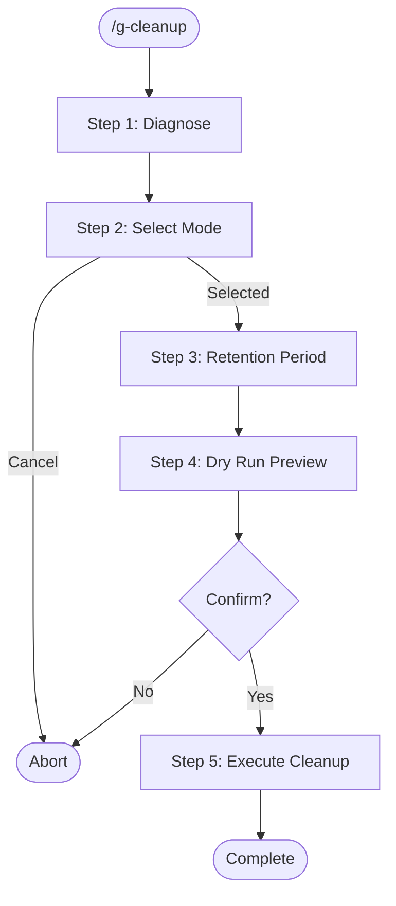

# g-cleanup Skill

Diagnose disk usage and selectively clean up ephemeral data from Claude Code and Codex CLI.

## Workflow



---

## Protected Paths (NEVER delete)

These paths must be excluded from all cleanup operations:

```
~/.claude/CLAUDE.md              # instruction file (symlink)
~/.claude/instructions/          # instruction files (symlink)
~/.claude/hooks/                 # hook scripts (symlink)
~/.claude/skills/                # skills (symlink)
~/.claude/settings.json          # user settings
~/.claude/config.json            # config
~/.claude/policy-limits.json     # policy
~/.claude/projects/*/memory/     # auto-memory (persists across sessions)
~/.codex/AGENTS.md               # agent instructions
~/.codex/config.toml             # config
~/.codex/rules/                  # approval rules (symlink)
~/.codex/.codex-global-state.json
```

---

## Cleanup Targets

### Claude Code (`~/.claude/`)

| ID | Category | Path | Description |
|----|----------|------|-------------|
| C1 | Sessions | `sessions/`, `session-env/` | Session metadata |
| C2 | Transcripts | `transcripts/` | Session transcripts |
| C3 | Project sessions | `projects/*/[uuid].jsonl` | Per-project conversation logs (preserve `memory/` dirs) |
| C4 | Backups | `backups/` | File backups |
| C5 | Cache | `cache/`, `paste-cache/` | Cache data |
| C6 | Logs | `logs/`, `debug/` | Debug and error logs |
| C7 | History | `history.jsonl` | Command history |
| C8 | File history | `file-history/` | File change history |
| C9 | Shell snapshots | `shell-snapshots/` | Shell state snapshots |
| C10 | Todos/Plans | `todos/`, `plans/`, `tasks/` | Task and plan data |
| C11 | Stats | `usage-data/`, `statsig/` | Usage statistics and analytics |

### Codex CLI (`~/.codex/`)

| ID | Category | Path | Description |
|----|----------|------|-------------|
| X1 | Worktrees | `worktrees/` | Git worktrees (often the largest) |
| X2 | Sessions | `sessions/`, `archived_sessions/` | Active and archived sessions |
| X3 | Temp files | `.tmp/`, `tmp/` | Temporary files |
| X4 | Logs | `log/` | TUI logs |
| X5 | Shell snapshots | `shell_snapshots/` | Shell state snapshots |
| X6 | Database | `sqlite/` | SQLite data |

### Temp files (`/tmp/`)

| ID | Category | Pattern | Description |
|----|----------|---------|-------------|
| T1 | Reports | `my-claude-audit-*.html` | Audit skill HTML reports |
| T2 | Claude temp | `claude-*` | Claude Code temp files |

---

## Step 1: Diagnose

Run disk usage analysis and display a summary table.

For each target, show:
- **Category** name and ID
- **File count** in the directory
- **Total size** (human-readable)
- **Oldest file** date
- **Newest file** date

Sort by size descending. Show grand total at the bottom.

```
=== Claude Code & Codex Cleanup Diagnostic ===

Claude Code (~/.claude/)
  ID   Category           Files   Size     Oldest       Newest
  C9   Shell snapshots      142   30.0M    2025-06-12   2026-04-05
  C3   Project sessions      11   12.0M    2025-09-24   2026-04-06
  C8   File history         320    9.4M    2025-08-01   2026-04-06
  ...

Codex CLI (~/.codex/)
  ID   Category           Files   Size     Oldest       Newest
  X1   Worktrees              8  847.0M    2025-11-03   2026-03-15
  X2   Sessions              57   48.0M    2025-10-01   2026-04-03
  ...

/tmp/
  ID   Category           Files   Size     Oldest       Newest
  T1   Reports                3    1.2M    2026-03-20   2026-04-01
  ...

Total: 952.3M across 6 categories
```

After displaying the table, proceed to Step 2.

---

## Step 2: Select Cleanup Mode

Present options to the user:

1. **All** — Clean all targets
2. **By category** — Select specific IDs (e.g., `C9, X1, X2`)
3. **Cancel** — Abort

Ask the user which mode to use.

---

## Step 3: Set Retention Period

Ask the user how many days of data to keep:

- Default: **30 days** (files older than 30 days are deleted)
- Option: **0 days** (delete everything in selected categories)
- Option: **Custom** number of days

**Special rules:**
- `C7` (history.jsonl): Truncate to keep only last N days of entries, do not delete the file entirely.
- `X1` (worktrees): Always list each worktree with its branch name and last modified date. Ask for confirmation on each one individually, since worktrees may contain uncommitted work.

---

## Step 4: Dry Run (Default)

**Always show a dry-run preview first.** Never delete without showing what will be removed.

For each selected category, list:
- Number of files to be deleted
- Total size to be freed
- Sample file paths (up to 5)

```
=== Dry Run Preview ===

[C9] Shell snapshots: 128 files, 28.5M to free
  ~/.claude/shell-snapshots/abc123.json (2025-06-12)
  ~/.claude/shell-snapshots/def456.json (2025-06-15)
  ... and 126 more

[X1] Worktrees: 3 worktrees to remove, 520.0M to free
  ~/.codex/worktrees/0dc9/ (branch: feature/foo, last modified: 2025-11-03)
  ~/.codex/worktrees/3741/ (branch: fix/bar, last modified: 2025-12-20)
  ~/.codex/worktrees/7006/ (branch: refactor/baz, last modified: 2026-01-15)

Total: 548.5M to be freed

Proceed with cleanup? [y/N]
```

---

## Step 5: Execute Cleanup

Only after user confirms:

1. Delete files matching the retention criteria in each selected category.
2. For directories: use `rm -rf` on individual old items, NOT on the parent directory itself.
3. For `C3` (project sessions): delete only `.jsonl` files and UUID-named directories, NEVER `memory/` directories.
4. For `C7` (history.jsonl): create a temp file with recent entries, then replace the original.
5. For `X1` (worktrees): use `git worktree remove` if inside a git repo, otherwise `rm -rf`.

Report results as each category is cleaned:

```
[C9] Shell snapshots: deleted 128 files, freed 28.5M
[X1] Worktrees: removed 3 worktrees, freed 520.0M
...

Cleanup complete. Total freed: 548.5M
```

---

## Notes

- **Dry-run is mandatory.** Never skip the preview step.
- **Never delete protected paths.** Double-check every path against the protected list before deletion.
- **Project memory is sacred.** `projects/*/memory/` must never be touched.
- **Worktrees need special care.** They may contain uncommitted changes — always confirm individually.
- **No recursive wildcards on parent dirs.** Delete contents selectively, not entire config directories.
- **history.jsonl is truncated, not deleted.** Users may want recent history preserved.
- **This skill only runs on explicit `/g-cleanup` invocation.** Never auto-trigger.
