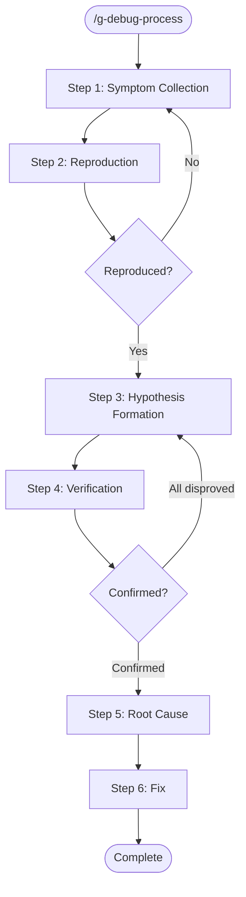

# g-debug-process Skill

Structured debugging workflow to avoid scattered investigation.
Forces systematic hypothesis-driven debugging.

## Workflow



---

## Step 1: Symptom Collection

Gather all available information about the issue:

1. **What is the error?** (error message, stack trace, unexpected behavior)
2. **When does it happen?** (always, intermittent, specific conditions)
3. **What changed recently?** (recent commits, dependency updates, config changes)
4. **How to reproduce?** (steps, environment, input data)

Summarize symptoms before proceeding.

**Confirm with user before proceeding to Step 2.**

---

## Step 2: Reproduction

Verify the bug is reproducible:

1. Follow the reproduction steps
2. Confirm the error matches the reported symptoms
3. If not reproducible, ask for more details

If reproduction requires running commands, do so.
Document the exact reproduction result.

**Confirm with user before proceeding to Step 3.**

---

## Step 3: Hypothesis Formation

Form up to 3 hypotheses, ranked by likelihood:

```
### Hypothesis 1 (most likely): <title>
- Why: <reasoning based on symptoms>
- How to verify: <specific check or test>
- Files to examine: <file paths>

### Hypothesis 2: <title>
...

### Hypothesis 3: <title>
...
```

**Confirm with user before proceeding to Step 4.**

---

## Step 4: Hypothesis Verification

Test hypotheses in order of likelihood:

For each hypothesis:
1. Perform the verification step defined in Step 3
2. Record the result: confirmed / disproved / inconclusive
3. If confirmed, proceed to Step 5
4. If all disproved, form new hypotheses (return to Step 3, max 2 rounds)

Present findings after each verification.

---

## Step 5: Root Cause Identification

State the confirmed root cause clearly:

```
## Root Cause
- **What**: <the actual bug>
- **Where**: <file:line>
- **Why**: <why this causes the symptom>
- **Impact**: <what else might be affected>
```

**Confirm with user before proceeding to Step 6.**

---

## Step 6: Fix

1. Propose the fix with explanation
2. After user approval, implement the fix
3. Verify the fix resolves the original symptom
4. Check for regressions in related functionality

Present the fix summary: what changed, why, and verification result.

---

## Principles

- Do not jump to fixing before understanding the root cause
- One hypothesis at a time -- don't shotgun multiple changes
- If stuck after 2 rounds of hypotheses, step back and reconsider assumptions
- Document findings as you go -- this helps if the issue recurs
