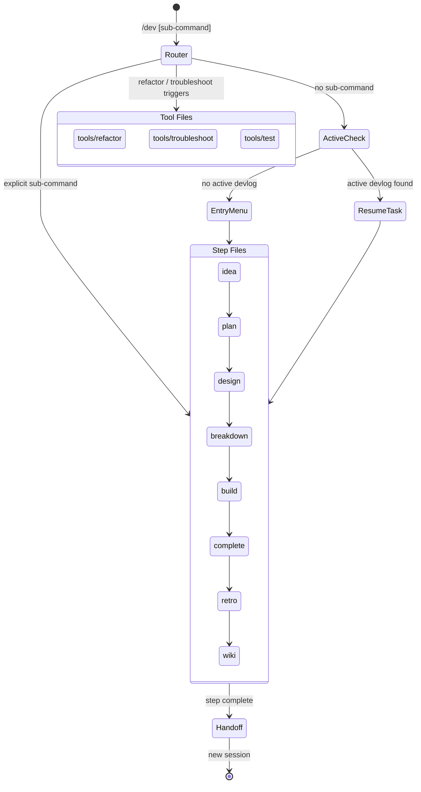

# dev — Unified Development Workflow

Single entry point for the full development lifecycle: ideation → planning → implementation → documentation.
Each sub-command maps to a step file. State persists across sessions via `_state.json` in devlogs.

---

## Flow Diagram



---

## Sub-command Router

Parse the first word after `/dev`. Load ONLY the matching file.

### Planning Lifecycle (devlog-tracked)

| Sub-command | Step file | Description |
|-------------|-----------|-------------|
| *(none)* | `steps/entry.md` | Active devlog check → resume or entry menu |
| `idea` | `steps/idea.md` | Ideation → brainstorm.md |
| `plan` | `steps/plan.md` | Requirements → PRD |
| `design` | `steps/design.md` | Architecture → TRD |
| `build` | `steps/build.md` | Feature implementation (1 feature/session) |
| `complete` | `steps/complete.md` | Wrap-up, insight, handoff to retro |
| `retro` | `steps/retro.md` | Retrospective → `04_Notes/<task>/retrospect.md` |
| `wiki` | `steps/wiki.md` | Process notes → `04_Notes/<task>/devnotes.md` + devlog cleanup |

### Utility Tools (inline, no devlog required)

| Sub-command / Natural language trigger | Tool file |
|----------------------------------------|-----------|
| `test` | `Read("tools/test/SKILL.md")` |
| `refactor`, "리팩토링 해줘", "코드 정리해줘", etc. | `Read("tools/refactor/SKILL.md")` |
| `troubleshoot`, error logs, stack traces, "에러 고쳐줘", etc. | `Read("tools/troubleshoot/SKILL.md")` |
| `review` | `steps/review.md` |
| `status` | `steps/status.md` | devlogs 루트 스캔 → 태스크 상태 요약 출력 |
| `help` | inline | 사용 가능한 서브커맨드 목록과 용도 출력 |

### help 출력 형식

`/dev help` 호출 시 다음을 직접 출력한다 (별도 파일 로드 없음):

```
/dev — Development workflow commands

Planning lifecycle (devlog-tracked):
  idea          vague concept → brainstorm.md
  plan          requirements → PRD
  design        PRD → TRD
  build         implement features (1 feature/session)
  complete      wrap-up + handoff to retro
  retro         retrospective → vault note
  wiki          process notes → vault + devlog cleanup

Utility tools (no devlog required):
  test          test code generation
  refactor      code cleanup / restructure
  troubleshoot  debug errors and stack traces
  review        code review workflow
  status        show all devlog task statuses

  help          show this message
```

---

## Natural Language Auto-routing

When triggered by natural language (not an explicit `/dev` command):

1. Analyze the trigger:
   - Refactoring keywords → load `tools/refactor/SKILL.md` directly, skip entry menu
   - Error/debug keywords or stack trace → load `tools/troubleshoot/SKILL.md` directly, skip entry menu
   - Otherwise → proceed to `steps/entry.md`

2. Skip the active devlog check for utility tools (test/refactor/troubleshoot).
   They operate on the current working files, not on a tracked devlog task.

---

## Devlog Path Detection

Resolve the devlogs root from `cwd`:

| cwd contains | devlogs root |
|---|---|
| `GitHubWork` | `~/Documents/GitHubWork/_claude/devlogs/` |
| `GitHubPrivate` | `~/Documents/GitHubPrivate/_claude/devlogs/` |
| neither | ask the user |

Task directory: `<devlogs-root>/YYYY-MM-DD-<repo>-<task-name>/`

---

## Session Restoration

When a sub-command is given AND `_state.json` exists in a matching task dir:

1. Read `_state.json`
2. Verify all `artifacts` paths exist on disk
3. Announce: "Resuming **<taskName>** at step `<currentStep>`"
4. Load the step file for `currentStep`

When `_state.json` does not exist: treat as a new task at the given entry point.

---

## Step Router (Pre-condition Guards)

| currentStep | Load file | Pre-condition |
|-------------|-----------|---------------|
| 0 | steps/entry.md | none |
| 1 | steps/idea.md | none |
| 2 | steps/plan.md | `artifacts.brainstorm` OR user input |
| 3 | steps/design.md | `artifacts.prd` exists |
| 4 | steps/breakdown.md | `artifacts.prd` exists (trd optional) |
| 5 | steps/build.md | `artifacts.features` exists |
| 6 | steps/complete.md | all `features[].status == "done"` |

Verify pre-conditions before loading. If not met, warn and block.

---

## State Management

All state persists in `_state.json` within the task subdirectory.
See `schemas/state.md` for the full schema and update rules.

Key rules:
- Update `currentStep` BEFORE loading the next step file
- Register artifact paths as soon as files are created
- Append to `history` at every state transition
- Each step ends with `steps/_handoff.md` pattern

---

## Cross-Agent Review Protocol

| Artifact | 1st Review | 2nd Review |
|----------|-----------|-----------|
| brainstorm.md | User confirmation | — |
| PRD | Plannotator + User | Codex |
| TRD / architecture | Plannotator + User | Codex |
| Feature breakdown | Plannotator + User | Codex |
| Code (Claude impl.) | Codex (`/codex:review`) | frontend-reviewer (if applicable) |
| Code (Codex impl.) | Claude (`code-reviewer` agent) | frontend-reviewer (if applicable) |

---

## External Tool Dependencies

| Tool | Purpose | Fallback |
|------|---------|----------|
| Plannotator | Visual review of PRD/TRD/features | Inline text review |
| codex-plugin-cc | Cross-review, implementation delegation | Claude-only review |
| Codex CLI | Non-interactive task delegation | Claude agent |

Never stop the workflow because a tool is missing. Fall back gracefully.

---

## Output Format

When dispatching agents, follow `agent-guidelines.md` Action Markers:
- `## 🤖 Agent: {task} ({model})` for each agent block
- Emoji action markers for tool/read/write operations
- `— parallel N/M` suffix for parallel dispatches
