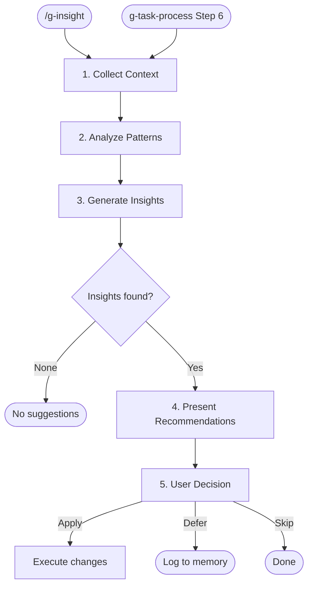

# g-insight

Post-task insight skill for Claude Code workflow improvement.
Works in any project. Analyzes conversation context (work history, repeated patterns,
tools used) and suggests actionable improvements to instructions, skills, agents, and config.

## Flow Diagram



---

## Process

### 1. Collect Context

Gather from the current conversation:
- Work summary (files changed, code created, problems solved)
- Tools / agents / skills used
- Repeated patterns or workflows
- Problems encountered and how they were resolved

When invoked from g-task-process: also consider `_state.json`, PRD, TRD, and feature breakdown artifacts.
When invoked standalone (`/g-insight`): rely on conversation context only — no task artifacts may exist.

### 2. Analyze Patterns

Evaluate collected context against these categories:

| Category | Criteria |
|----------|----------|
| **Instruction candidate** | Same convention manually applied 2+ times? |
| **Skill candidate** | Reusable workflow with 3+ steps? |
| **Config sharing** | Project-specific setting useful across projects? |
| **Agent improvement** | Missing context in agent prompts? Subagent used where main context was better (or vice versa)? |
| **Agent candidate** | Repeated delegation pattern that could become a custom agent definition? |
| **Token efficiency** | Redundant file reads, verbose prompts, wrong tool choice (e.g. Agent(Explore) where Grep sufficed), non-English in instruction/skill files? |
| **Memory update** | Content in MEMORY.md needs correction or supplement? |

### 3. Generate Insights

Produce insights only for categories that apply.
Do NOT force insights when nothing meaningful is found.

Insight format:

```
### [Category] Title
- **Observation**: What was noticed
- **Suggestion**: What change to make
- **Target**: Which file / setting to modify
- **Impact**: Expected improvement
```

### 4. Present Recommendations

```
## Insight Report

### Found: N suggestion(s)

1. [Instruction] ...
2. [Skill] ...
...

For each item choose: Apply / Defer / Skip
```

### 5. User Decision

| Choice | Action |
|--------|--------|
| **Apply** | Execute the change immediately (edit file, create skill, etc.). If the modified file belongs to a repository (resolve symlinks to find the source), follow that repository's CLAUDE.md Post-Task Workflow if one exists. |
| **Defer** | Append to the current project's auto memory (`~/.claude/projects/<project>/memory/MEMORY.md`) under a `## Deferred Insights` section. Create the section if it does not exist. |
| **Skip** | Do nothing |

---

## Principles

- **Minimize noise**: Only suggest meaningful insights. If none, end with "No suggestions."
- **Run in main context**: Do NOT delegate to a subagent. Full conversation context is required.
- **Works in any project**: This skill runs wherever a task was performed. It focuses on improving Claude Code workflows (instructions, skills, config, agents, memory), not on project code quality — that belongs to code-reviewer and other review tools.
- **Inline steps**: Steps are tightly coupled and short — kept inline rather than extracted to `steps/`.
