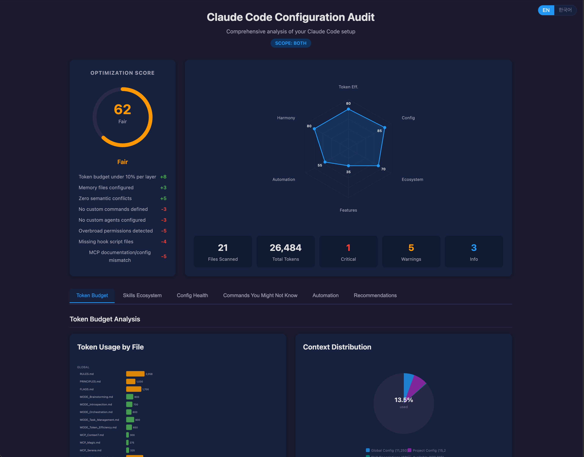

# my-claude-audit

Comprehensive audit of your Claude Code configuration with an interactive HTML dashboard. Analyzes token efficiency, config health, skills ecosystem, feature utilization, and automation opportunities across all layers.



## Features

- **Token Budget Analysis** — Per-file token usage visualization with bar charts, pie charts, and sortable tables. Tracks `@` reference chains and transitive token costs.
- **Configuration Health** — Validates permissions, hooks, semantic conflicts, and structure. Detects overbroad permissions, missing hook scripts, and contradictory instructions.
- **Skills Ecosystem** — Inventories all installed skills across marketplaces, detects overlaps, checks CSO (Claude Search Optimization) quality, and flags disabled-but-installed plugins.
- **Commands You Might Not Know** — Identifies Claude Code commands and features you're not using yet (e.g., `clear`, custom `/commands`, custom agents, auto-memory).
- **Automation Opportunities** — Finds manual workflows that could be automated with hooks, agents, or custom commands.
- **Cross-Layer Analysis** — Detects overlaps and gaps between global (`~/.claude/`) and project-level (`.claude/`) configurations.
- **6-Dimension Scoring** — Rates your setup across Token Efficiency, Config Health, Ecosystem Health, Feature Utilization, Automation Level, and Cross-Layer Harmony.
- **Multilingual** — Full Korean and English support with auto-detection and toggle.

## Usage

```
/my-claude-audit
```

The skill will:
1. Ask you to choose a scope (Both / Global only / Project only)
2. Dispatch parallel subagents to analyze your configuration
3. Generate an interactive HTML dashboard
4. Open it in your browser

## How It Works

```
/my-claude-audit
  → Scope Selection (Both / Global / Project)
  → Discovery (read settings.json, glob config files)
  → Parallel Analysis
     ├── Token & Config Analyzer
     └── Skills Ecosystem Analyzer
  → Insights Aggregation (cross-layer, scoring, recommendations)
  → HTML Report Generation
  → Open in Browser
```

### Subagent Architecture

| Subagent | Responsibility |
|----------|---------------|
| Token & Config Analyzer | Token budget per file, config health, permissions, hooks, MCP alignment |
| Skills Ecosystem Analyzer | Skill inventory, overlap detection, CSO quality, plugin distribution |
| Insights Aggregator | Cross-layer analysis, missed commands, automation opportunities, 6-dimension scoring |

## Report Sections

### Dashboard
Score gauge (0-100) with color-coded label, 6-axis radar chart for dimension breakdown, and summary statistics.

### Token Budget
Horizontal bar chart grouped by layer (Global/Project), context distribution pie chart, and sortable file details table with `@` reference tracking.

### Skills Ecosystem
Grid of skill cards color-coded by marketplace, CSO quality indicators, overlap warnings, and plugin distribution chart.

### Config Health
Pass/fail checklist covering permissions, hooks, semantic conflicts, MCP alignment, and structure validation with fix commands.

### Commands You Might Not Know
Cards for each underutilized feature with description, benefit, and fix command.

### Automation Opportunities
Side-by-side comparison of current manual workflows vs. suggested automated alternatives with effort badges.

### Recommendations
All findings sorted by severity (critical → warning → info) with filter chips and actionable fix commands.

## Installation

### Personal skill (simplest)

```bash
cp -r skills/my-claude-audit ~/.claude/skills/my-claude-audit
```

### Via symlink

```bash
ln -s /path/to/harness/skills/my-claude-audit ~/.claude/skills/my-claude-audit
```

### As part of a plugin marketplace

Add this harness repo as a local marketplace in `~/.claude/settings.json`.

## Configuration

No configuration needed. The skill auto-discovers your setup by reading `~/.claude/settings.json` and project-level configs.

## Requirements

- Claude Code CLI
- Chrome DevTools MCP (optional, for auto-opening the report)

## License

MIT
