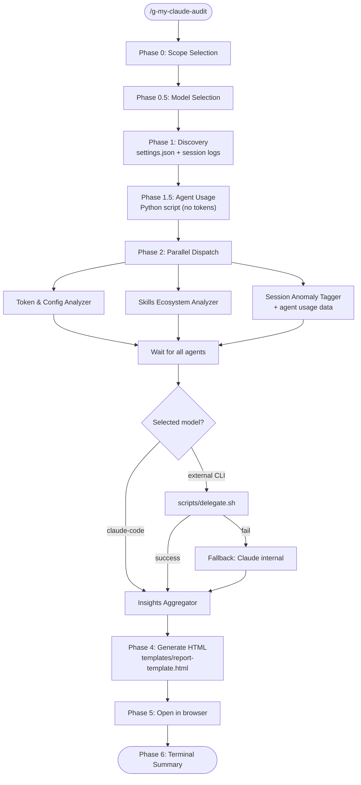

# /g-my-claude-audit

Comprehensive audit of your Claude Code configuration with an interactive HTML dashboard. Analyzes token efficiency, config health, skills ecosystem, feature utilization, and automation opportunities across all layers.

## Workflow



## Phase 0: Scope Selection

Ask the user with AskUserQuestion:

- **Both** (Recommended): Analyze global config + current project config
- **Global only**: Analyze only ~/.claude/ settings, skills, and framework
- **Project only**: Analyze only the current project's CLAUDE.md and .claude/ directory

## Phase 0.5: Model Selection

Scan for available external CLI tools:

1. Run `which gemini`, `which openai`, `which codex` to detect installed tools
2. Check env vars: `GEMINI_API_KEY`, `OPENAI_API_KEY` (existence only)

Ask the user with AskUserQuestion:

Build options dynamically — only show installed tools. Always include:
- Each installed tool as an option, annotated with "(API key detected)" if env var exists
- **Claude Code (built-in)** — always available, no external dependency
- **Custom input** — user types a custom CLI command

Store the selection for Phase 3 delegation and `meta.analyzer` report attribution.

## Phase 1: Discovery

Read `~/.claude/settings.json` and extract:

- `pluginMarketplaces` array (marketplace names and paths)
- `hooks` configuration (all event types)
- `enabledPlugins` map
- `permissions.allow` and `permissions.deny`
- `enabledMcpjsonServers`
- `env` variables

Use Glob to list all global config files: `~/.claude/*.md`

If project scope (both or project-only):

- Read `$PWD/CLAUDE.md` (if exists)
- Read `$PWD/.claude/settings.json` (if exists)
- Read `$PWD/.claude/settings.local.json` (if exists)

### Session Log Discovery

- Resolve current project path encoding: replace `/` with `-` in `$PWD`, strip leading `-`
- List `~/.claude/projects/<encoded-cwd>/*.jsonl` (exclude `subagents/` subdirectories)
- Sort by modification time descending, select up to 5 most recent
- If no JSONL files found, note as info-level and skip session analysis

## Phase 1.5: Agent Usage Analysis (Python — zero tokens)

Run the agent usage analyzer script to extract agent delegation patterns from session logs.
This runs as a Python process, consuming no LLM tokens.

1. Discover the script path: `<skill-dir>/scripts/agent-usage-analyzer.py`
2. Run: `Bash(python3 <skill-dir>/scripts/agent-usage-analyzer.py --days 30)`
3. Parse stdout as JSON and store as `agentUsageData`
4. If exit code != 0 or empty output, set `agentUsageData = null` and continue (graceful skip)

Pass `agentUsageData` to:
- **Agent 3** (Session Anomaly Tagger) as additional input
- **Agent 4** (Insights Aggregator) as additional input

## Phase 2: Dispatch Parallel Subagents

Dispatch using the Agent tool (subagent_type: Explore).

**For each subagent:**

1. Read the prompt file content from `analyzer-prompts/` using the Read tool (do NOT use `@` syntax -- it force-loads and wastes context)
2. Prepend the discovered data (file paths, settings contents) as context
3. Dispatch with clear instruction to return ONLY JSON

**Dispatch (parallel):**

```
Agent 1: token-and-config.md prompt + discovery data + scope
Agent 2: skills-ecosystem.md prompt + enabledPlugins + pluginMarketplaces
Agent 3: session-anomaly-tagger.md prompt + session JSONL file paths + agentUsageData JSON
```

All three run in parallel. Wait for all to complete.

## Phase 3: Insights Aggregation (delegatable)

After all parallel agents complete:

**If selected model is Claude Code (internal):**

```
Agent 4: insights-aggregator.md prompt + combined JSON from Agents 1, 2 & 3 + scope
```

**If selected model is an external CLI tool:**

1. Read `analyzer-prompts/insights-aggregator.md` using the Read tool
2. Combine: insights-aggregator prompt + all 3 agent JSONs + scope info
3. Write combined prompt to `/tmp/claude-audit-prompt-<timestamp>.txt`
4. Print status: "Analyzing with external model... ({tool})"
5. Discover delegate.sh path from this skill's directory: `scripts/delegate.sh`
6. Run: `Bash(<skill-dir>/scripts/delegate.sh <tool> /tmp/claude-audit-prompt-<timestamp>.txt)`
7. Parse result:
   - Exit 0 + non-empty stdout → attempt JSON parse. If valid JSON, use as insights. If parse fails (invalid JSON), log warning and fallback.
   - Exit 0 + empty stdout → fallback
   - Exit 1 → fallback
8. **Fallback**: Print "External tool ({tool}) failed. Falling back to Claude Code internal analysis." then run Agent 4 internally

Set `meta.fallbackUsed = true` if fallback was triggered.

## Phase 4: Assemble & Generate HTML Report

Combine all 3 outputs into a single object:

```json
{
  "meta": {
    "timestamp": "<ISO 8601>",
    "scope": "both|global|project",
    "version": "2.0.0",
    "analyzer": "gemini|openai|codex|claude-code|custom",
    "analyzerCommand": "<actual command used>",
    "fallbackUsed": false,
    "projectPath": "<$PWD if scope includes project, null otherwise>"
  },
  "tokenAndConfig": {},
  "skillsEcosystem": {},
  "sessionAnomaly": {},
  "agentUsage": {},
  "insights": {}
}
```

**Note:** `agentUsage` is the raw JSON output from Phase 1.5 Python script (not from a subagent).

Then:

1. Read the template: `templates/report-template.html` (relative to this skill's directory)
2. JSON-stringify the combined results
3. Replace `{{AUDIT_DATA}}` in the template with `const AUDIT_DATA_RAW = <stringified JSON>;`
4. Write to: `/tmp/claude-audit-<timestamp>.html`
   - timestamp format: YYYYMMDD-HHmmss

## Phase 5: Open in Browser

1. Try: `mcp__chrome-devtools__navigate_page` with `file:///tmp/claude-audit-<timestamp>.html`
2. Fallback: `Bash(open /tmp/claude-audit-<timestamp>.html)` (macOS)
3. Fallback: `Bash(xdg-open /tmp/claude-audit-<timestamp>.html)` (Linux)

## Phase 6: Terminal Summary

```
## Audit Complete

**Score:** XX/100 -- [Label]
**Scope:** Both / Global / Project
**Report:** /tmp/claude-audit-<timestamp>.html

### Dimension Scores:
- Token Efficiency: XX/100
- Config Health: XX/100
- Ecosystem Health: XX/100
- Feature Utilization: XX/100
- Automation Level: XX/100
- Cross-Layer Harmony: XX/100

### Top Findings:
1. [Most impactful finding]
2. [Second finding]
3. [Third finding]

### Quick Wins:
- [Easiest fix command]
- [Second easy fix]
```

## Key Rules

- **No hardcoded paths.** Everything from settings.json discovery.
- **Subagents return JSON only.** Include complete JSON example in every prompt.
- **Token estimation:** chars / 4. Context window: 200,000 tokens.
- **Read prompt files, don't @-import them.** Use Read tool to get content, then include in Agent prompt.
- **Clean up:** The /tmp/ file persists for user reference. Do not delete it.
