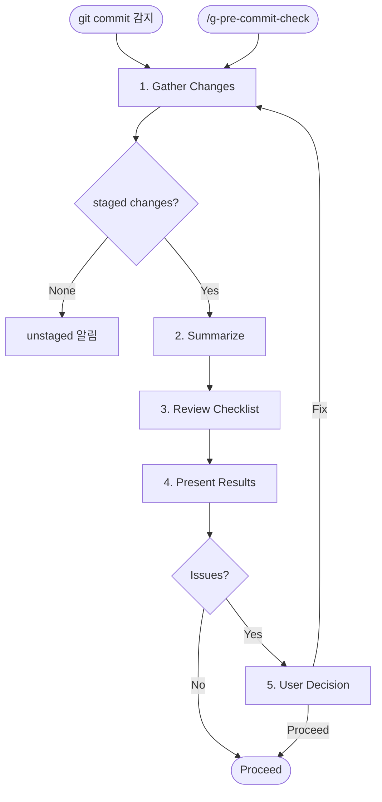

# g-pre-commit-check Skill

Automated self-review before every commit. This skill is triggered proactively
when Claude detects commit intent, and also enforced via a PreToolUse hook
on `git commit` commands.

## Workflow



---

## When to Run

- Automatically before any `git commit` command
- Manually via `/g-pre-commit-check`

---

## Process

### 1. Gather Changes

Run `git diff --cached --stat` and `git diff --cached` to see all staged changes.
If nothing is staged, check `git diff` for unstaged changes and inform the user.

### 2. Summarize Changes

Produce a brief summary:
- Files changed (added/modified/deleted)
- Nature of changes (feature, bugfix, refactor, docs, etc.)
- Estimated scope (small / medium / large)

### 3. Review Checklist

Check each item against the staged diff:

#### Correctness
- [ ] Logic appears correct for the stated purpose
- [ ] Edge cases considered
- [ ] No incomplete implementations (no TODO/FIXME left behind)

#### Security
- [ ] No hardcoded secrets (API keys, passwords, tokens)
- [ ] No `.env` files or credentials staged
- [ ] User input is validated where applicable
- [ ] No SQL injection, XSS, or command injection risks

#### Code Quality
- [ ] No unused imports or dead code
- [ ] No debug logs (`console.log`, `print`, `debugger`) left in
- [ ] No commented-out code blocks
- [ ] Type errors addressed (if TypeScript/typed language)

#### Completeness
- [ ] Tests added or updated for new functionality
- [ ] Related documentation updated if needed
- [ ] All acceptance criteria met (if working on a tracked feature)

### 4. Present Results

Format the review as:

```
## Pre-Commit Review

**Changes**: <summary>
**Scope**: small / medium / large

### Passed
- <items that passed>

### Issues Found
- <severity> <file:line> <description>

### Recommendation
- Proceed with commit / Fix issues first
```

### 5. Decision

- If all checks pass: proceed with the commit
- If issues found: present them and wait for user decision
  - User says fix: fix the issues, re-run check
  - User says proceed anyway: allow the commit with a note

---

## Principles

- Be concise: the review should take seconds, not minutes
- Focus on substance: don't flag style issues unless they affect readability
- Trust the developer: flag issues, don't block -- the user decides
- Never skip the security check, even for small changes
