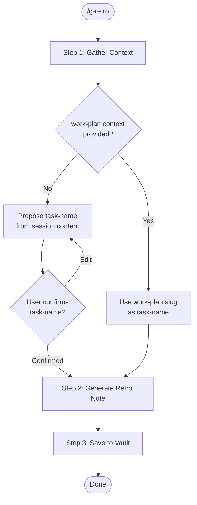

# g-retro Skill

Generate a session retrospective and save it to the Obsidian vault.

## Vault Path

```
retrospect: ~/Documents/obsidian-vault/02.Wiki/retrospect/
filename:   YYYY-MM-DD-<task-name>-retrospect.md
```

## Workflow



## Step Router

Read ONLY the step file for the current step.

| Step | File | Description |
|------|------|-------------|
| 1 | `steps/step-1-gather.md` | Collect session context and resolve task-name |
| 2 | `steps/step-2-generate.md` | Draft the retrospective note |
| 3 | `steps/step-3-save.md` | Save to Obsidian vault |

## Invocation Modes

| Mode | Trigger | task-name source |
|------|---------|-----------------|
| Manual | `/g-retro` | Proposed from session content → user confirms |
| From work-plan-close | Called with work-plan folder path as argument | Work-plan folder slug (auto) |
