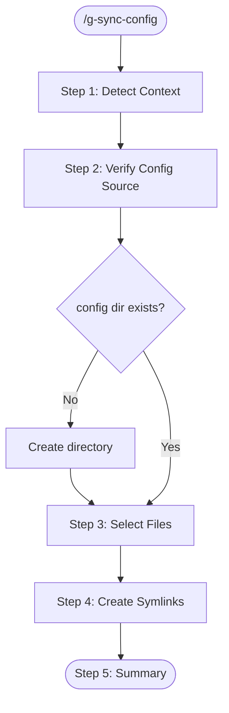

# g-sync-config Skill

Link shared configuration files from the workspace `_claude/config/` to the current project's `.claude/` directory.

**Default target: the directory where this skill is invoked (project root).**

## Workflow



---

## Step 1: Detect Context

1. Get the current working directory (project root).
2. Determine workspace type from the path:
   - Path contains `GitHubWork` → workspace: `~/Documents/GitHubWork/`
   - Path contains `GitHubPrivate` → workspace: `~/Documents/GitHubPrivate/`
   - Otherwise → ask the user which workspace to use.
3. Set config source: `<workspace>/_claude/config/`

---

## Step 2: Verify Config Source

1. Check if `<workspace>/_claude/config/` exists.
2. If it does not exist:
   - Ask: "Config directory not found at `<path>`. Create it now?"
   - If confirmed, create the directory.
   - If this is the first setup, suggest creating a `settings.local.json` with appropriate defaults.
3. List available config files in the source directory.

---

## Step 3: Select Files to Link

Present the available files and current link status:

```
Source: ~/Documents/GitHubWork/_claude/config/

  settings.local.json    [not linked]
  .mcp.json              [already linked]
```

Ask user to confirm which files to link. Default: all unlinked files.

---

## Step 4: Create Symlinks

For each selected file:

1. Ensure `.claude/` directory exists in the project root.
2. If the target file already exists:
   - If it's a symlink pointing to the correct source → skip.
   - If it's a symlink pointing elsewhere → ask to update.
   - If it's a regular file → ask to backup and replace, or skip.
3. Create a **relative** symlink (e.g., `../../_claude/config/settings.local.json`).
4. Report result for each file.

**Use relative paths for symlinks** so they remain valid if the parent directory is moved.

---

## Step 5: Summary

Show the final state:

```
Project: ~/Documents/GitHubWork/one/
Config:  ~/Documents/GitHubWork/_claude/config/

  .claude/settings.local.json → ../../_claude/config/settings.local.json  [created]
  .claude/.mcp.json            → ../../_claude/config/.mcp.json            [skipped, already linked]
```

---

## Notes

- **Relative symlinks only.** Absolute paths break if directories move.
- **Never overwrite without confirmation.** Always ask before replacing existing files.
- **GitHubPrivate projects are independent by default.** The skill still works for GitHubPrivate but the user may choose not to share config across personal projects.
- Config files are **not version-controlled** (security). They should be in `.gitignore`.
- This skill only creates links. To manage the content of config files, edit them directly in `_claude/config/`.
