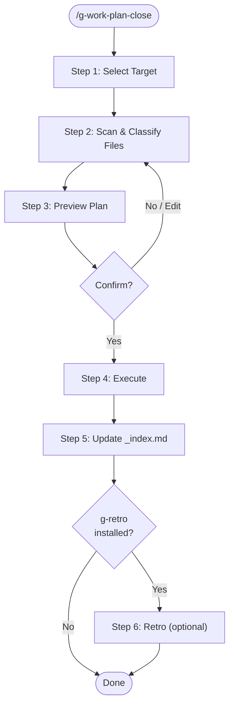

# g-work-plan-close Skill

완료된 work-plan 폴더를 정리하고 보관 가치 있는 문서를 30_Archive/로 이동한다.

## Vault Paths

```
vault:           ~/Documents/obsidian-vault/
company plans:   ~/Documents/obsidian-vault/10_Active/_work-plans/company/
personal plans:  ~/Documents/obsidian-vault/10_Active/_work-plans/personal/
archive:         ~/Documents/obsidian-vault/30_Archive/
```

## Workflow



---

## Step 1: Select Target

인자가 제공된 경우 해당 폴더를 사용한다.
제공되지 않은 경우, company와 personal의 work-plan 목록을 보여주고 선택받는다.

```
Available work-plans:

[company]
  1. 2026-04-07-one-sentry-insight
  2. 2026-04-08-one-theme-modularization-prd
  ...

[personal]
  6. 2026-04-17-obsidian-my-llm

Which work-plan to close? (number or folder name):
```

선택된 폴더가 company인지 personal인지 기록해둔다 — 아카이브 경로 결정에 사용.

---

## Step 2: Scan & Classify Files

폴더 내 모든 파일을 재귀적으로 스캔하고 아래 기준으로 분류한다.

### Archive 대상 (30_Archive/로 이동)

아래 패턴에 해당하는 `.md` 파일은 보관 가치가 있다고 판단한다:

| 패턴 | 예시 | 이유 |
|------|------|------|
| `PRD-*.md`, `TRD-*.md` | PRD-sentry-insight.md | 설계 결정 기록 |
| `brainstorm.md` | brainstorm.md | 아이디에이션 |
| `requirements.md`, `features.md` | requirements.md | 요구사항 정의 |
| `*-retrospect.md`, `retrospect.md` | sprint-retrospect.md | 회고 |
| `session-insights.md` | session-insights.md | 작업 인사이트 |
| `README.md` | README.md | 프로젝트 개요 |

### Delete 대상 (삭제)

실행 로그나 임시 산출물로, 재활용 가치가 낮다:

| 패턴 | 예시 | 이유 |
|------|------|------|
| `step-*.md` | step-1-cleanup.md | 실행 단계 로그 |
| `_state.json` | _state.json | Claude 내부 상태 |
| `init_instructions.md` | init_instructions.md | 초기 지시사항 |
| `*.html` | report.html | 생성된 artifact |
| `*.json` (단, `_state.json` 외) | report-data.json | 대용량 데이터 |
| `plan.md` (task-process 플랜 파일) | plan.md | 실행 계획 (git history로 충분) |

### Ask 대상 (사용자 판단)

위 패턴에 해당하지 않는 `.md` 파일은 내용 요약을 보여주고 보관/삭제 여부를 묻는다.

---

## Step 3: Preview Plan

실행 전 사용자에게 명확한 플랜을 제시한다. 승인 없이 절대 실행하지 않는다.

```
## Close Plan: 2026-04-07-one-sentry-insight

### Archive → 30_Archive/10_company/2026/
  ✅ PRD-sentry-insight.md
  ✅ brainstorm.md
  ✅ session-insights.md

### Delete
  🗑️  step-0-create-alignment.md
  🗑️  _state.json
  🗑️  report-data.json (187KB)
  🗑️  sentry-insight-report.html (128KB)

### Ask
  ❓ skill-skeleton/SKILL.md  → Archive or Delete?

Proceed? (y/n/edit)
```

`edit` 입력 시 분류를 재조정할 수 있도록 개별 파일 처리 방식을 다시 물어본다.

---

## Step 4: Execute

### 4-1. Archive 경로 결정

| 출처 | Archive 경로 |
|-----|-------------|
| company | `30_Archive/10_company/YYYY/` |
| personal | `30_Archive/YYYY/` |

`YYYY`는 work-plan 폴더명의 연도 부분에서 추출한다 (예: `2026-04-07-*` → `2026`).
해당 연도 폴더가 없으면 생성한다.

### 4-2. 파일 이동

Archive 대상 파일을 결정된 경로로 이동한다.
파일명 충돌 시 `<원래이름>-<work-plan-slug>.md` 형식으로 rename한다.

예:
```
PRD-sentry-insight.md → 30_Archive/10_company/2026/PRD-sentry-insight.md
brainstorm.md         → 30_Archive/10_company/2026/brainstorm-sentry-insight.md
```

### 4-3. 삭제 실행

Delete 대상 파일을 삭제한다.
work-plan 폴더 자체도 비워진 후 삭제한다.

---

## Step 5: Update _index.md

해당 work-plan의 출처(company/personal)에 맞는 `_index.md`를 업데이트한다.

- `## Active Tasks` 섹션에서 해당 항목을 제거한다.
- `## Archived` 섹션이 없으면 파일 하단에 추가한다.
- 아카이브된 문서 링크를 `## Archived` 섹션에 추가한다.

```markdown
## Archived

### sentry-insight (2026-04-07)
- PRD: [[PRD-sentry-insight]]
- Brainstorm: [[brainstorm-sentry-insight]]
```

---

## Step 6: Retro (Optional)

Check whether the g-retro skill is installed:

1. Glob `~/.claude/skills/retro/SKILL.md`
2. **Not found** → skip silently, close is complete
3. **Found** → ask the user:
   ```
   Write a session retro? (y/n)
   ```
   - `n` → skip
   - `y` → invoke the `g-retro` skill, passing the selected work-plan folder path as context

---

## Principles

- **Dry-run 필수**: Step 3 Preview 없이는 절대 실행하지 않는다.
- **삭제 전 확인**: 삭제는 되돌릴 수 없다. 의심스러우면 Archive로 분류한다.
- **git history로 충분한 것은 삭제**: step 파일, _state.json은 Git에 이미 커밋되어 있으면 삭제해도 무방하다.
- **파일 내용 기반 판단**: 패턴 매칭이 불확실한 파일은 첫 20줄을 읽어 내용을 파악한 후 분류한다.
